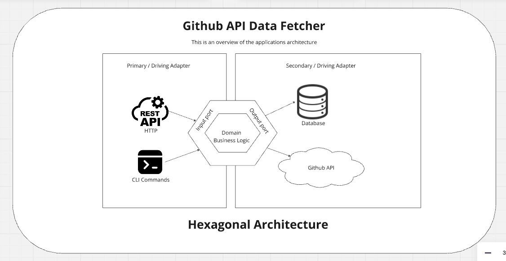

### GitHub API Data Fetcher
#### Overview
This project is a GitHub API data fetcher designed to retrieve repository and commit data, store it in a database, and monitor the repositories for new commits. It is structured using the Ports and Adapters (Hexagonal) architecture to ensure separation of concerns and easy maintainability.

#### Setup Instructions
##### Prerequisites
- Go (version 1.20)
- Docker
- Docker Compose

##### Installation
1. Clone the repository:

```
git clone git@github.com:oluwatobi1/gh-data-fetching.git
cd gh-data-fetching
```
2. Install dependencies:
```
go mod tidy
```
3. Setup environment variables (create a ./config/dev.env file based on ./configs/sample_env):

```
GITHUB_TOKEN= value (this is required)
PORT=8000 (required)
ENVIRONMENT=debug (required)
DB_URL=github_monitoring.db (required)
DEFAULT_REPO=chromium/chromium (optional)
START_DATE=2024-08-02(optional)
END_DATE=2024-07-02 (optional)
```

`GITHUB_TOKEN` is  github pat_token. it is used to authenticate requests to github. Sample, token format `github_pat_51A5IY4T3Y0Bksajq..............`.
To get your Personal Access Token (PAT) see: https://docs.github.com/en/authentication/keeping-your-account-and-data-secure/managing-your-personal-access-tokens

`DB_URL` is sqlite db name

`DEFAULT_REPO`: default github repository to be fetch and monitored when application starts. Sample `chromium/chromium`

`START_DATE`: commit fetch start date if empty it fetches all commits from repo start

`END_DATE`: commit fetch end date if empty it fetches all commits until current day
##### Running the Application
1. Start the application using Docker Compose:
```
docker compose -f docker-compose.yaml build
docker compose -f docker-compose.yaml up
```
2. Alternatively, you can run the application directly:
```
go run cmd/main.go
```
NB: Running the application gets the  `DEFAULT_REPO` from env if it is set fetches the repo meta if it does not exist, then pull  commit based on  `START_DATE` and `END_DATE` range and begin monitoring **all** fetched repo hourly

#### Adding Repo and Fetching Commits
Starting the application automatically adds(if not added ) and begins tracking the `DEFAULT_REPO`

1. Via HTTP: New repo's can be added existing monitored repos through this route
Steps:
    - Start the application [via docker-compose(recommended), docker, or manually(bare-metal)]
    - Send a Get request to `http://localhost:{ENV.PORT}/api/v1/fetch-repo?repo={owner}/{repo}`
    An example `http://localhost:8000/api/v1/fetch-repo?repo=chromium/chromium`
    - A success response indicate the new repo has been added. Commits would be fetch and monitored on the background.
    Sample success response `{
    "code": 0,
    "message": "success",
    "data": null
}`

#### 1. Get Top N Commit Authors
**Endpoint: GET /api/v1/top-commit-authors**

Description: Retrieves the top N commit authors by commit count from the database.

Query Parameters:
- page (optional, default: 1): The page number for pagination.
- page_size (optional, default: 10): The number of commits (N).

Response:

200 OK: Returns a list of top commit authors with their commit counts.

400 Bad Request: Invalid request parameters.

500 Internal Server Error: Error fetching top commit authors.

Example Request:
`http://localhost:8000/api/v1/top-commit-authors?page=1&page_size=30`


#### 2.  Retrieve Commits by Repository Name
**Endpoint: GET /api/v1/commits?repo_name**

Description: Retrieves commits of a repository by its name from the database.

Query Parameters:
- repo_name(required):The full_name of the repository.
- page (optional, default: 1): The page number for pagination.
- page_size (optional, default: 10): The number of commits (N).

Response:

200 OK: Returns a list of commits for the specified repository.

400 Bad Request: Missing repository name or invalid pagination parameters.

500 Internal Server Error: Error fetching commits for the repository.

Example Request:
`http://localhost:8000/api/v1/commits?repo_name=chromium/chromium&page=1&page_size=12`


#### Key Components
##### API Layer
**File**: _internal/adapter/api/github_api.go_

**GitHubAPI**: This struct handles the communication with the GitHub API.
**FetchRepository**(repoName string): Fetches the repository details from GitHub.
**FetchCommits**(repoName string, repoId uint, config models.CommitConfig): Fetches commits from GitHub based on the provided configuration.
GORM Layer
**File**: internal/adapter/db/gorm

**Repository**: Implements the repository operations.

**Create(repo *models.Repository):** Creates a new repository record.
**FindAll():** Retrieves all repositories.
**FindByName(name string):** Finds a repository by name.
**UpdateLastCommitSHA(id uint, sha string):** Updates the last commit SHA of a repository.
**Commit**: Implements the commit operations.

**Create(commit *models.Commit)**: Creates a new commit record.
**FindByHash(hash string):** Finds a commit by its hash.
**FindByRepoId(repoId uint):** Finds commits by repository ID.
**FindAll():** Retrieves all commits.


##### Event System
**File**: _internal/core/events/events.go_

Defines events such as AddCommitEvent and StartMonitorEvent used for the event-driven architecture.
**File**: _internal/services/event_bus.go_

**EventBus**: Handles the event publishing and subscribing mechanism.
#### Handlers
**File**: _internal/handlers/handlers.go_
**InitNewRepository:** Add a new repo to application Database if it doesn't exits, if it does, it starts monitoring the repo
***AppHandler**: Handles the business logic and interacts with the API and database layers.
**HandleAddCommitEvent**(event events.AddCommitEvent):** Handles the AddCommitEvent.
CommitManager(repo *models.Repository, config models.CommitConfig):** Manages the fetching and storing of commits.

#### Architecture Diagram


### Alternative  Link
Can't see image preview,open `./architecture_diagram.png`. file